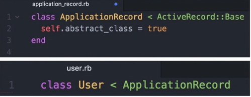
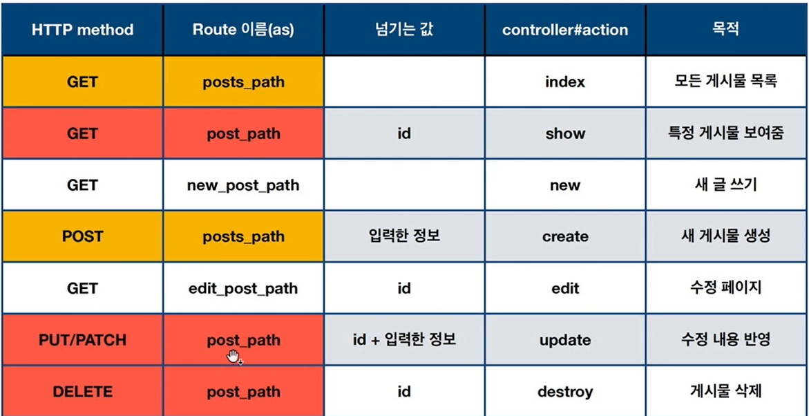

# Note

인강들으면서 리마인드

## reference

+ [도라도라 블로그](https://kbs4674.tistory.com/)

+ [인썸니아 인강](https://insomenia.com/courses)

+ [ruby cheat-sheet](https://github.com/Itsbeenalongday/Ruby-study)

## ORM

Object-Relation Mapper

instance가 많아지면 기억을 못하기에 database로 관리한다

DB 관리 언어

SQL

SQL로 관리하는 DB - 관게형 데이터베이스

```sql
select * from users where name = "dodo"
```

Rails에서 사용하는 ORM Framework를 Active Record라고 부른다.
이것을 사용하여 SQL을 사용하지 않고 ORM으로 DB 접근한다.

<div align="center">



</div>

## 구현하기

### 1. 컨트롤러 생성
```bash

$ rails g controller <controller name>

```
컨트롤러를 생성하게 되면, 자동적으로 대응되는 View파일이 생성된다.

### 2. app 폴더 내에 MVC가 존재한다.

```
app/
|
|-- controllers/
|
|-- models/
|
|-- views/
```

### 3. action에서는 데이터를 처리하고 view에서는 결과를 보여준다

**rails에서는 view파일이름과 controller파일이름을 같게 만들어줘야한다.**

### 4. erb는 ruby코드를 삽입할 수 있는 html의 확장판이다. (erb == embedded ruby)

views/layouts/ 내에 applications.html.erb가 존재하는데, 이 것은 쉽게 생각하면 만들어지는 view파일의 슈퍼조상이라고 생각하면 편하다

applications.html.erb
```ruby
<!DOCTYPE html>
<html>
  <head>
    <title>BlogProject</title>
    <%= csrf_meta_tags %>
    <%= csp_meta_tag %>

    <%= stylesheet_link_tag 'application', media: 'all', 'data-turbolinks-track': 'reload' %>
    <%= javascript_pack_tag 'application', 'data-turbolinks-track': 'reload' %>
  </head>

  <body>
    <%= yield %>
  </body>
</html>
```
위 yield태그는 사용자가 만드는 erb파일을 가리키게된다 예를 들어,  
만약 사용자가 index.html.erb를 생성하게 되면 위 구조를 따르되, yield태그를 사용하여   
사용자가 작성한 코드를 작성하게 되면 그 내용이 yield태그를 대체하게 되어 하나의 html이 만들어 지는 것이다   
java에서 abstract개념과 비슷하다. 구현은 뒤로미루고 상속받는 erb에서 구현되게 만들어 놓는 그런 느낌이다.   

### 5. action하고 view를 만들면 항상 경로를 지정해야한다.

/config/routes.rb에서 경로지정

```ruby
Rails.application.routes.draw do
  # For details on the DSL available within this file, see https://guides.rubyonrails.org/routing.html
  root "home#<erb file name>" # localhost:3000접속시 보여주는 페이지 지정 - root
end
```

+ routing
>어떤 url이 들어오면 이런 방식(url 요청방식)으로 저런 동작(컨트롤러 액션)을 해라

형식
```
<url요청방식> <사용자가 요청하는 url>, to: <요청된 url을 처리할 컨트롤러#액션>
```

```ruby
home컨트롤러의 attack액션
get '/attack', to: 'home#attack'
home컨트롤러의 defense액션
get '/defense' to: 'home#defense'
```

### 6. 정보전송 

form태그로 정보를 전송했다고 하자
그러면 보낸 정보들이 해당 url을 처리하는 액션(메소드)에서 처리를 같이해라
이 정보들은 어디담겨있느냐?
-> params

```ruby
<%= params %>
```

일련의 과정을 정리해보면 이렇다
1. index페이지에서 form태그를 사용하여 /attack url로 정보를 params에 담아서 전송하게 된다
2. 해당 url을 처리하는 액션에서 이 정보를 받아 처리할 수 있다.
3. /attack url에서 `<%=params%>`를 통해서 전달된 정보를 확인할 수 있다.

params 내용은 
```ruby
{"args"=>"~~~"...,"controller"=>"homw", "action"=>"attack"}
```
이러한데, 뜯어보면home controller의 attack액션에서 args들을 할 수 있다.   

**erb파일에서 ruby코드 사용법**

```
=는 화면에 보여주고 싶을 때 optional하게 사용
<%(=) codes... %>
```

+ 작업의 흐름


### 7. controller를 만들 때 액션과 라우트를 자동으로 설정하기

```bash

$ rails g controller <controller name> <actions...>
```

### 8. get과 post의 차이

+ get: 입력한 정보를 url에 노출(노출이 되어도 상관없는 정보)

```html
<form action="/home/create" method="get">
    제목: <input type="text" name="post_title"><br/>
    내용: <textarea name="post_content"></textarea><br/>
    <input type="submit" value="작성">
</form>
```
작성시 이동된 url

http://localhost:3000/home/create?post_title=d&post_content=dd

+ post: 입력한 정보를 숨겨서 보냄(노출이 되면 안되는 정보)

```html
<form action="/home/create" method="post">
    제목: <input type="text" name="post_title"><br/>
    내용: <textarea name="post_content"></textarea><br/>
    <input type="submit" value="작성">
</form>
```

```ruby
post 'home/create'
```

보안토큰 에러가 난다. => CSRF 해킹공격때문에 막아놓았다

그래서 form태그에 
```ruby html
<%= hidden_field_tag :authenticity_token, form_authenticity_token %>
```
이 코드를 붙여야한다.

params를 보면 아래와 같이 보안토큰이 붙은 것을 볼 수 있다.

```ruby
{"authenticity_token"=>"9oDN41lX9b72eU6UAKcmifcWFcs1Bmh2wXuZqJ6aFG+/bY9FBSfLLXxQ8LBlq/R1m2Dzu4a/OJLAiT6netS8og==", "post_title"=>"3213", "post_content"=>"123213213", "controller"=>"home", "action"=>"create"}
```

ruby의 form_for를 쓰면 보안 토큰을 안전하게 처리

### 9. 모델 생성하기

```bash
$ rails g model <model_name>
```

제목, 내용을 저장할 table=> model
            +
입력한 정보를 테이블에 넣어주는 기능=> create 액션


/app/model/모델.rb

/db/migrate/테이블.rb => 테이블의 모양을 결정

테이블의 모양을 확정
```bash
$ rails db:migrate
```

테이블 삭제
```bash
$ rails db:drop
```

이제 테이블의 내용을 params를 이용하여 쌓아나간다

**어떻게 controller의 instance variable을 view에서 사용할 수 있는것인가?**

[rails opensource](https://github.com/rails/rails/blob/0c5552a3dd28e35cce64462765cc41c5355db0f1/actionpack/lib/abstract_controller/rendering.rb#L84-L86)

```ruby
view가 rendering될 때, 인스턴스 변스와 그 값이 controller에서 선택되어,
view의 initializer로 전달되고, view 인스턴스가 만들어진다.

아래와 같은 ruby method들이 사용된다

*instance_variables - gets names of instance variables 
*instance_variable_get(variable_name) - gets value of an instance variable
*instance_variable_set(variable_name, variable_value) - sets value of an instance variable

과정을 보자

1. controller에서 instance variable을 뽑아낸다.

def view_assigns
  hash = {}
  variables  = instance_variables
  variables -= protected_instance_variables
  variables -= DEFAULT_PROTECTED_INSTANCE_VARIABLES
  variables.each { |name| hash[name[1..-1]] = instance_variable_get(name) }
  hash
end

2. view로 instance variable을 전달한다
def view_context
  view_context_class.new(view_renderer, view_assigns, self)
end

3. view를 setting한다
def assign(new_assigns) # :nodoc:
  @_assigns = new_assigns.each { |key, value| instance_variable_set("@#{key}", value) }
end
```

### 10. db에 들어간 데이터 조회

```bash
$ rails c

irb(main):001:0> Post.all 
```
rails c 명령은 rails interperter를 실행시키는 명령이다      
여기서 Post.all을 하게되면 Post 모델의 모든 데이터가 조회된다.   

index페이지에서 이것을 확인해보자
```ruby html
<% Post.all.each do |instance| %>
    제목: <%=instance.title%><br/>
    내용: <%=instance.content%><br/>
    <% for i in 0...instance.content.length %>
    <%= '_' %>
    <% end %>
    <br/>
<%end%>
```

### 11. 삭제

늘 그렇듯 어떤 기능을 만들려고 하면 해당 프로세스를 따른다

```
< controller에서 액션을 만든다 >
          |
          v
< 액션에 맞는 라우팅을 지정한다 >
          |
          v
  < 액션에서 수행할 결과>
          |
          | -------------> 안 보여줘도 된다.
          |
          v 보여준다
< view로 가서 html.erb를 만들어서 꾸민다 >
```

delete도 마찬가지임

+ 모든 instance 삭제
```bash
irb(main):001:0> Post.destroy_all
```
+ 특정 instance 삭제 - id이용

```ruby
<% Post.all.each do |instance| %>
    제목: <%=instance.title%><br/>
    내용: <%=instance.content%><br/>
    <a href="/home/destroy/<%=instance.id%>">[삭제]</a><br/>
    <% for i in 0...instance.content.length %>
    <%= '_' %>
    <% end %>
    <br/>
<%end%>
```
url에 id를 추가하였다 -> route설정도 다시 해줘야 한다.
params(액션으로 넘기는 모든 정보)로 id를 알 수 있다.

```ruby
Rails.application.routes.draw do
  # For details on the DSL available within this file, see https://guides.rubyonrails.org/routing.html
  root 'home#index'
  get 'home/index'
  # get 'home/index' => home#index
  # home/index가 get방식으로 요청되면 home controller의 index액션을 실행
  # 이게 없으면 redirect_to '/home/index'에서 에러가 난다
  get 'home/new'
  post 'home/create'

  # url과 action이 같다면 단축이가능한데
  # 이제 destroy와 destroy/:post_id로 url이 구분되므로 위와같이 단축할 수 없다. 
  # 아래와 같이 url이 요청되면 home controller의 destroy액션으로 이동해라를 명시해야함
  get 'home/destroy/:post_id' => 'home#destroy'
  # /post_id, 문자그대로 post_id url이 됨
  # /:post_id, post_id를 변수로 만들어 id를 저장할 수 있다.
end

```

### 12. 수정

수정하면서 id는 두 번 쓰이게 된다   
1. 수정하는 양식에 이전에 썼던 특정 내용을 불러올 때   
2. 이전 글을 수정한 뒤 새로운 내용으로 업데이트 할 때   

```ruby
 def edit
        @post = Post.find(params[:post_id]) # 이전 내용을 불러온다
    end

    def update
        # 인스턴스 변수를 사용하는 경우는 view파일에서 사용해야 할 때 사용
        post = Post.find(params[:post_id])
        post.title = params[:post_title]
        post.content = params[:post_content]
        post.save

        redirect_to "/home/index"
    end
```

edit은 글을 수정하는 공간으로 이동시키는 액션

update는 수정된 글을 반영하는 액션

으로 볼 수 있다.

다음은 routes.rb파일의 일부이다.

```ruby
# 수정하는 공간으로 라우팅
  get 'home/edit/:post_id' => 'home#edit'
  # 수정을 반영하기 위한 라우팅
  post 'home/update/:post_id' => 'home#update'
```
`수정하고싶은 것`만 수정하면 되기에 글 전체를 지칭하는 것이 아닌,   
특정글을 선택하여 수정해야한다.   
때문에 id가 필요하게 되고, 해당 글을 수정하기 위해 url에 id를 넘겨준다.   

```ruby
# edit.html.erb

<form action="/home/update/<%=@post.id%>" method="post">
    <%= hidden_field_tag :authenticity_token, form_authenticity_token %>
    제목: <input type="text" name="post_title" value=<%=@post.title%>><br/>
    내용: <textarea name="post_content"><%=@post.content%></textarea><br/>
    <input type="submit" value="수정">
</form>
```
여기서는 기존 내용을 불러와야 하기 때문에 value에 title과 content가 들어간 것을 볼 수 있다   

action으로 지정된 것은 update인 것을 확인 할 수 있는데 제출을 하게 되면, update액션으로 이동하게 된다.

### 13. scaffold

+ view_helper
view를 다루기 쉽게 만든다.

1. a태그를 쉽게 대체해 보자

```ruby html
<%=link_to '텍스트', url %>

<a href="url"> 텍스트 </a>
```

**주의점**
```ruby
<%= link_to '삭제', "posts/destroy/#{post.id}">
```
루비 문법을 써야하는 상태에서   
문자열 안에 문자가 아닌 변수를 넣으려면   
`#{}`로 감싸줘야 한다   

**url을 간소화 해보기**
```ruby
 # 수정하는 공간으로 라우팅
  get 'home/edit/:post_id' => 'home#edit', as: 'home_destroy'
  # 수정을 반영하기 위한 라우팅
  post 'home/update/:post_id' => 'home#update', as: 'home_update'
```

저렇게 as로 이름을 바꾸고

```ruby
<%=link_to 'content', home_destroy_path(post_id: post.id) %>
```
_path를 붙이고 keyword argument(안쓰고 post.id만 넘겨도 됨)를 지정해서 넘기게 되면   
url을 대체할 수 있다   

2. Restful

+ scaffold
구조, 뼈대라는 뜻으로   
rails에서 scaffold는 migration/ model/ routes/ controller/ view를 한 번에 처리할 수 있는 것을 말한다. 

```bash
$ rails g scaffold posts title:string content:text
```
로 하게 되면,   
모델이름은 Post가 되고, 컨트롤러이름은 posts가 된다.

controller이름은 model의 복수형으로 만드는 것이 관례  

하고 난 후에 migration file을 확인하고, 테이블을 확정지어줘야 한다.

```bash
$ rails db:migrate
```

Restful은 무엇(resource)을 어떻게(HTTP method) 할 지 표현

+ resource는 crud할 수 있는 정보 ex) 하나의 게시물, 유저, 댓글 etc...

+ HTTP method 추출(GET)/ 생성(POST)/ 변경(PUT/PATCH)/ 제거(DELETE)

어떤 동작을 할 지 예측할 수 있다.

<div align="center">



</div>

왜 HTTP method를 사용하는가?

```
같은 url을 사용하고, http method로 동작을 달리 지정해주면,
url을 재사용할 수 있고, 서버의 처리측면에서도 효율적이다

/post/:id --|-- get
            |-- put
            |-- delete
```

다음은 index.html.erb의 일부이다

```ruby
<% @posts.each do |post| %>
      <tr>
        <td><%= post.title %></td>
        <td><%= post.content %></td>
        <td><%= link_to 'Show', post %></td>
        <td><%= link_to 'Edit', edit_post_path(post) %></td>
        <td><%= link_to 'Destroy', post, method: :delete, data: { confirm: 'Are you sure?' } %></td>
      </tr>
    <% end %>
```

link_to의 url부분에 post가 들어가 있는 것을 볼 수 있다.   
여기서 post는 게시글 하나를 지칭하는 것이기 때문에 url 부분에 post를 쓰게되면   
알아서 자동적으로 url을 생성해주고, 우리가 할 일은 method만 지정해주면 되는 것이다.   
post는 post_path(id: post.id) 또는 post_path(post)와 동일한 것이다.   
그리고 method를 따로 지정하지 않으면 default는 get이다.   

3. scaffold 샅샅이 훑어보기

+ new.html.erb
```ruby
<h1>New Post</h1>

<%= render 'form', post: @post %>

<%= link_to 'Back', posts_path %>
```
'form'은 무엇일까?

+ _form.html.erb

render로 그리기 위해서는 파일명 앞에 `_`가 붙어야 한다.   

그리고 post는 form_for에서 사용되는 변수이고, 이것을 함께 넘겨주게 된다.

```html
<%= form_with(model: post, local: true) do |form| %>
  <% if post.errors.any? %>
    <div id="error_explanation">
      <h2><%= pluralize(post.errors.count, "error") %> prohibited this post from being saved:</h2>

      <ul>
        <% post.errors.full_messages.each do |message| %>
          <li><%= message %></li>
        <% end %>
      </ul>
    </div>
  <% end %>

  <div class="field">
    <%= form.label :title %>
    <%= form.text_field :title %>
  </div>

  <div class="field">
    <%= form.label :content %>
    <%= form.text_area :content %>
  </div>

  <div class="actions">
    <%= form.submit %>
  </div>
<% end %>
```
+ edit.html.erb

```ruby
<h1>Editing Post</h1>

<%= render 'form', post: @post %>

<%= link_to 'Show', @post %> |
<%= link_to 'Back', posts_path %>

```

그렇다면 여기서 의문: 어떻게 edit하고 new하고 같은 form을 쓰는거지?   

new는 새로운 생성이고, edit은 이전의 내용을 불러와야 하는 것인데 말이지   

form_for의 기능에 그 비밀이 숨겨져있다.   

form_for는 모델 객체(post)가 신규인지, 이미 저장 완료 됐는지를 판단하여 적절한 url로 안내하기 된다.   

즉 @post = Post.new이면 create액션으로, @post = Post.find(params[:id])이면 update액션으로 보내준다.   

때문에, 이전의 프로젝트에서 new action에서는 아무 작업도 하지 않고 view만 보여줬지만,   form_for를 사용하기 위해서는 @post가 새로운 객체인지 이미 존재하던 객체인지 알려줘야 하기 때문에 `@post = Post.new`라는 코드를 삽입해야한다.   

+ before_action

controller에 이러한 코드가 있다

```ruby
 before_action :set_post, only: [:show, :edit, :update, :destroy]
```

해석해보자만 before_action이란 것은 사전에 해야할 동작을 지칭하는 것으로

 ruby에서는 이런 코드가 가능하다

 ```ruby
 def hello msg: :"hello world"
 puts msg
 end

 class Greet
 hello
 end

 g = Greet.new

 g.hello
 g.hello msg: :"world hello"
---------------------------
 => hello world
 => world hello
 ```

즉, before_action이란 method를 Postscontroller클래스에서 사용하는 것인데
인자로 set_post라는 심볼객체를 받고 only라는 키워드 변수를 사용하여
show edit update destroy의 심볼들을 지정한다.

```ruby
method(:some_symbol)
```
method 메소드는 argument로 넘어온 문자열이나 심볼이 그 이름과 맞는 메소드를 찾아서 실행 시켜준다

```ruby
method("puts").call("hello")
```
이런식으로 말이다. 그래서 메소드이름으로 된 심볼들이 argument로 넘어가는 것이다.

[ruby symbol](https://negabaro.github.io/archive/ruby-hash-symbol)
[method()](https://stackoverflow.com/questions/14736452/understanding-ruby-symbol-as-method-call)

정리하자면, before_action은 only에서 지정된 컨트롤러의 액션이 실행되기 전에 실행되야할 함수(set_post)를 지정하는 필터링 역할을 하는 것이다.

```ruby
before_action :set_post, only: [:show, :edit, :update, :destroy]
```

검색할 때 rails filter라고 하면 될 듯하다.   

+ respond_to 메서드

지정된 형식에 따라 다른 템플릿을 출력(html, json)   

url.json붙이면 json형태로 보인다.

```
localhost:3000/new.json
```

```ruby
 def create
    @post = Post.new(post_params)

    respond_to do |format|
      if @post.save
        format.html do redirect_to @post, notice: 'Post was successfully created.' end
        format.json { render :show, status: :created, location: @post }
      else
        format.html { render :new }
        # render함수에 json을 키워드 매개변수로 넘긴것, status키워드 매개변수에 unprocessable_entity라는 symbol을 넘긴것
        format.json { render json: @post.errors, status: :unprocessable_entity }
      end
    end
  end
```

`redirect_to @post`는 해당 게시물이 보이는 곳으로 redirect된다.(show page)

+ strong parameter

받고 싶은 것만 받자

```ruby
def post_params
  params.require(:post).permit(:title, :content)
end
```

post모델에서 title, content속성만을 받아와라   

+ flash

일시적으로 띄워주는 메시지

redirection 전 후로 메시지를 띄울 때

```ruby
flash[:아무이름] ="넣고싶은 메시지"

flash[:notice] = "성공적인 메시지"
flash[:alert] = "경고, 실패의 메시지"
```

```ruby
respond_to do |format|
      if @post.save
        flash[:notice] = 'Post was successfully created.'
        format.html do redirect_to @post end
        format.json { render :show, status: :created, location: @post }
      else
        format.html { render :new }
        # render함수에 json을 키워드 매개변수로 넘긴것, status키워드 매개변수에 unprocessable_entity라는 symbol을 넘긴것
        format.json { render json: @post.errors, status: :unprocessable_entity }
      end
    end
```

+ form_helper

  - 자동으로 CSRF 방지 코드 삽입(히든 토큰)
  - 기본 메소드는 POST

`form_tag`
- 범용적인 입력 양식(모델과 관련이 없음)
- ex) 검색 키워드, 조건

`form_for`
- 특정한 모델 편집
- ex) 게시물 생성, 수정
- 형식
```ruby
<%=form_for(테이블 한 행, url:posts_path, method:'post') do |row| %>
  <%= f.태그종류 %>
<%end%>
```

**form_for 사용 시 주의점**
1. 모델과 관련이 있기때문에, params의 속성 즉, name지정 시, 모델의 shcema와 이름이 같아야한다.
2. params가 2중 hash로 둘러싸여있어서 참조하는 코드도 달리해줘야한다.

```ruby
{"post" => {"title" => '제목', 'content' => '내용'}}

post = Post.find(params[:post_id]) 
post.title = params[:post][:title]
post.content = params[:post][:content]
```
3. @post에 따라 url, value, method를 따로 지정하지 않아도 자동으로 지정해줌   
   그래서 new.html.erb나 edit.html.erb가 코드가 동일
```ruby
<%=form_for @post  do |f| %>
    <%=f.label :title, '제목'%>
    <%=f.text_field :title %><br/>
    <%=f.label :content, '내용'%>
    <%=f.text_area :content %><br/>
    <%=f.submit '작성'%>
<%end%>
```

+ render
new.html.erb와 edit.html.erb가 같다고 했다.   
코드의 중복이 생긴다.   

1. 재사용되는 코드를 저장할 파일을 만든다.

주의할 점은 파일명 앞에 `_`를 붙여야 한다는 것

__예시__

_form.html.erb
```ruby
<%=form_for(@post) do |f| %>
    <%=f.label :title, '제목'%>
    <%=f.text_field :title%><br/>
    <%=f.label :content, '내용'%>
    <%=f.text_area :content%><br/>
    <%=f.submit '수정'%>
<%end%>
```

그리고 해당 코드가 필요한 위치에 한 줄만 넣어주면 된다.

```ruby
<%= render 'form' %>
```

+ routing

```ruby
resources :posts, controller: "home" 
# 컨트롤러는 home인데, 만들어진 url은 posts를 사용하니까 컨트롤러 지정을 따로해줘야한다. 
```
restful하게 자동으로 라우팅 생성

+ 생성과 저장위치 지정을 한꺼번에 처리하기

```ruby
# 기존의 방식
post = Post.new
post.title = params[:post][:title]
post.content = params[:post][:content]

# 위의 작업을 한번에 해줄 수 있다.
post = Post.new( # 생성
  title: params[:post][:title] # 저장위치 지정
  content: params[:post][:content]
)

# 위의 방식도 귀찮다
post = Post.new(post_params)

private
def post_params
  params.require(:post).permit(:title, :content) # 자동으로 마지막 줄이 리턴되므로
end
```
## 14. devise

1. gemfile에 gem 'deivse'를 작성

2. 로그인할 수 있는 환경 구축
```bash
$ bundle install

$ rails g devise:install

$ rails g deviese:views

$ rails g devise User
```
- User model 생성(devise와 연동이 되게하기 위해 model이 아닌 devise 명령을 사용)
- route에 devise_for:users가 추가됨, user와 관련된 url생성
- migration파일 자동생성

+ user.rb
```ruby
class User < ApplicationRecord
  # Include default devise modules. Others available are:
  # :confirmable, :lockable, :timeoutable, :trackable and :omniauthable
  devise :database_authenticatable, :registerable,
         :recoverable, :rememberable, :validatable
end
```


+ 주석 처리된 것은 필요하면 해제해서 사용하란 의미로 포함   
  - confirmable: 유저 인증
  - lockable: 회원 정지 ex) 비밀번호 3회 입력 오류 
  - timeoutable: 일정 시간 뒤 자동 로그아웃
  - omniauthable: facebook, google 로그인 연동

+ routes.rb

```ruby
Rails.application.routes.draw do
  devise_for :users
  # For details on the DSL available within this file, see https://guides.rubyonrails.org/routing.html
  root 'home#index'
  
  resources :posts, controller: "home" 
```
+ uesr와 연관된 라우트 설정

+ migration

```ruby
# frozen_string_literal: true

class DeviseCreateUsers < ActiveRecord::Migration[6.0]
  def change
    create_table :users do |t|
      ## Customizing
      t.string :name
      ## Database authenticatable
      t.string :email,              null: false, default: ""
      t.string :encrypted_password, null: false, default: ""

      ## Recoverable
      t.string   :reset_password_token
      t.datetime :reset_password_sent_at

      ## Rememberable
      t.datetime :remember_created_at

      ## Trackable
      # t.integer  :sign_in_count, default: 0, null: false
      # t.datetime :current_sign_in_at
      # t.datetime :last_sign_in_at
      # t.string   :current_sign_in_ip
      # t.string   :last_sign_in_ip

      ## Confirmable
      # t.string   :confirmation_token
      # t.datetime :confirmed_at
      # t.datetime :confirmation_sent_at
      # t.string   :unconfirmed_email # Only if using reconfirmable

      ## Lockable
      # t.integer  :failed_attempts, default: 0, null: false # Only if lock strategy is :failed_attempts
      # t.string   :unlock_token # Only if unlock strategy is :email or :both
      # t.datetime :locked_at


      t.timestamps null: false
    end

    add_index :users, :email,                unique: true
    add_index :users, :reset_password_token, unique: true
    # add_index :users, :confirmation_token,   unique: true
    # add_index :users, :unlock_token,         unique: true
  end
end

```

3. 어느 페이지에서나 찾아볼 수 있어야 하므로 application.html.erb에 로그인/로그아웃 ui를 만들어 줘야 한다.   

```ruby
<% if user_signed_in?%> <!--로그인이 되어있는 경우-->
  <%=current_user.email%>
  <%=link_to '로그아웃', destroy_user_session_path, method: :delete%>
<%else%> <!--로그인이 안되어 있는 경우-->
  <%=link_to '회원 가입', new_user_registration_path%>
  <%=link_to '로그인', new_user_session_path%>
<%end%>

```

uesr_signed_in? 이나 current_user.email의 경우 devise가 제공해주는 method라고 생각하면 된다.

4. 이제 로그인/로그아웃이 되니 이것과 게시판을 연동해보자

1) 컨트롤러에 다음과 같은 코드를 삽입한다.
```ruby
before_action :authenticate_user!
```
+ 로그인 하지 않으면 넘어가지 않는다.
+ only로 특정 액션만 적용 가능하다.
+ except로 특정 액션을 배제할 수 있다.

2) 가입할 때 user의 추가정보를 받는 방법

+ app/view/devise/registrations/new.html.erb
  - 회원 가입 view
+ app/view/devise/registrations/edit.html.erb
  - 회원 수정 view

해당 view파일에서 migration에 넣어준 정보를 받는다.

3) 제대로 들어오는지 확인한다.

근데 위와 같은 절차로 하니 들어오지 않았다.   

곰곰히 생각해보니 우리는 devise와 관련된 컨트롤러를 작성한 적이 없다.   

그래서 이와 관련된 컨트롤을 어디서 하나 찾아보니 모든 컨트롤러의 부모격인 application_controller(흡사 application.html.erb: 모든view의 조상)과 같은 역할을 하는 것이 있었다.

여기다가 다음과 같은 코드를 넣어주면 devise를 컨트롤 할 수 있게된다.

[rails devise](https://github.com/heartcombo/devise)

```ruby
class ApplicationController < ActionController::Base

    before_action :configure_permitted_parameters, 
        if: :devisecontroller?
    # devise와 관련있는 컨트롤러 일 때만 실행되게 만듦

    def configure_permitted_parameters
        # keys에 자신이 추가한 속성을 써준다.
        # 가입할 때 추가속성 :sign_up(keyword)
        devise_parameter_sanitizer.permit(:sign_up, keys: [:name])
        # 수정할 때 추가속성 :account_update(keyword)
        devise_parameter_sanitizer.permit(:account_update, keys: [:name])
    end
end

```

__keypoint__
+ controller가 부재할 때는 어디에 컨트롤 코드를 작성할 것인지를 추론해보는 것

4) 마지막으로 devise_for :user 라우트 이름 변경

+ routes.rb
```ruby
devise_for :users, path: 'user', path_names: {sign_in: 'login', sign_out: 'logout'}
 # path는 컨트롤러 이름 # path_names액션 이름
#sign_in은 login으로 sign_out은 logout으로
```

## 15. Comment

1. 관계를 생각해보자

+ 1개의 글은 N개의 댓글을 가질 수 있다

+ N개의 댓글은 하나의 게시물에 속한다.

때문에 댓글은 게시물/사용자의 ID를 가져야한다.

```bash
$ rails g model comment content:string post:references


```
를 하게 되면 게시물 즉 post모델의 id를 comment가 포함하게 되고,   
이것은 foreign key이다.

2. 모델간의 관계 맺기

+ post.rb

```ruby
  has_many :comments # 하나의 게시물이 n개의 댓글, 복수형
```

+ comment.rb
```ruby
  belongs_to :post # n개의 댓글이 하나의 게시물에 속함
```

3. 컨트롤러 만들기

**controller의 이름은 model의 복수형으로**

```bash
$ rails g controller comments create destroy
```

4. 라우팅 설정

댓글은 게시글에 속해있다. => 라우트도 마찬가지로 속해야한다.

ex) /post/1/comments/2 

요런식으로

때문에 routing 지정방식이 조금 특이한데

+ routes.rb

```ruby
resources :posts, controller: "home" do
    resources :comments, only: [:create, :destroy]
  end
```

이렇게 post의 경로내에 집어넣으면 중첩이 된다.

5. 이제 본격적인 액션을 만들어보자

+ create
```ruby
def create
    comment = Comment.create(comment_params)
    comment.post_id = params[:post_id]
    comment.save
    redirect_to post_path(params[:post_id])
  end

 private
  def comment_params
    params.require(:comment).permit(:content)
  end
```
게시글 생성과 별 다른 거 없다. 다만 id가 post_id를 내포하고 있기 때문에   
post_id저장하는 과정이 필요하다.   
comment_params에 post_id를 포함시킬 수도 있겠지만 url에 id가 내포되어 있기 매문에 굳이 안넣어줘도 된다. 만약 이런 방법으로 하려면 form_for태그에서 hidden_field를 통해 post_id를 또 
보내야한다.

+ destroy

삭제도 게시글 삭제와 똑같다

```ruby
def destroy
    Comment.find(params[:id]).destroy
    redirect_to post_path(params[:post_id])
end
```

별 내용이 없기에 여기까지 정리하겠다.

## 16. User

uesr와 게시글, user와 댓글을 연결지어보자

1. migration 파일에 속성 추가
```bash
$ rails g migration add_user_to_comment user:references

$ rails db:migrate
```

테이블을 삭제하지 않고도 변경할 수 있는데, 그 방법은 테이블의 마이그레이션을 변경하는 것이다.   

+ column추가 `add_칼럼_to_테이블`

+ column삭제 `remove_칼럼_from_테이블`

이 규칙들은 마이그레이션파일의 이름이 된다.

2. 관게를 맺어줘야 한다.

+ user.rb
```ruby
has_many :comments
```

+ comment.rb
```ruby
belongs_to :user
```

관계를 맺어줘야 나중에 따로 코드를 작성하지 않아도 `post.comment.id` 이렇게 참조가 될 수 있는 것이다.   

예시)
```ruby
<% @post.comments.each do |c| %>
    <%=c.content%>
    <%=link_to '[삭제]', post_comment_path(@post.id, c.id), method: :delete %>
<%end%>
```

3. 컨트롤러에서 user의 정보를 저장하기

+ comments_controller.rb
```ruby
class CommentsController < ApplicationController
  def create
    comment = Comment.create(comment_params)
    comment.post_id = params[:post_id]
    comment.user_id = current_user.id # 현재 로그인 되어있는 user가 댓글의 작성자
    comment.save
    redirect_to post_path(params[:post_id])
  end

 ...

end
```

4. 자신의 댓글만 삭제할 수 있도록 구현해보기

+ show.html.erb

```ruby
<% @post.comments.each do |c| %>
    <%=c.content%>
    <%if c.user_id == current_user.id%> <!--댓글의 user_id와 current_user.id가 같을 때만-->
        <%=link_to '[삭제]', post_comment_path(@post.id, c.id), method: :delete %>
    <%end%>
    <br/>
<%end%>
```

## 17. M : N 관계 해시태그