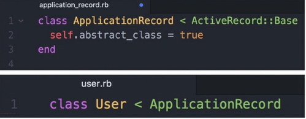

# Note

인강들으면서 리마인드

## ORM

Object-Relation Mapper

instance가 많아지면 기억을 못하기에 database로 관리한다

DB 관리 언어

SQL

SQL로 관리하는 DB - 관게형 데이터베이스

```sql
select * from users where name = "dodo"
```

Rails에서 사용하는 ORM Framework를 Active Record라고 부른다.
이것을 사용하여 SQL을 사용하지 않고 ORM으로 DB 접근한다.


